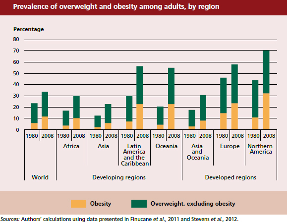
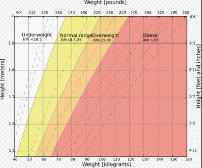
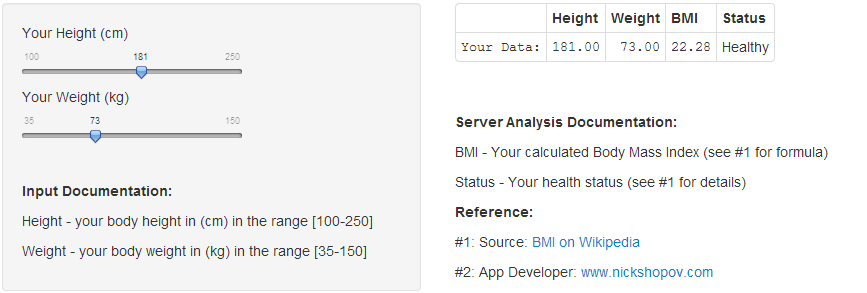

## The Issue

<center></img></center>

--- .class #id 

## The Measure
* BMI stands for "Body Mass Index"
* BMI is a common measure to calculate your obesity level based on your height and weight
* The BMI score is therefore an important index for your health

<center></img></center>

---

## The BMICalc App
* Fortunately, the <a href="https://nsbi.shinyapps.io/Shiny_BMICalc/" target="_blank">BMI Calculator App</a> is there to help you get started!
<ol>
<li> Calculate your BMI and see your Health Status quickly and easily;</li>
<li> Nail down your Height and use the interactive slider to see your healthy Weight margins.</li>
</ol>

<center></img></center>

---

## Your Turn
* Let's assume you are 181cm tall and you want to be healthy
* Your "Golden Mean" would be:

```r
iMinWeight <- 18.5 * ((181/100)^2)
iMaxWeight <- 25 * ((181/100)^2)
iAvg<-mean(c(iMinWeight,iMaxWeight))
return (iAvg)
```

```
## [1] 71.26
```

* Go to the <a href="https://nsbi.shinyapps.io/Shiny_BMICalc/" target="_blank">BMI Calculator App</a> to test see your bottom and upper margins 
* Be healthy! Stay healthy! Be happy!
